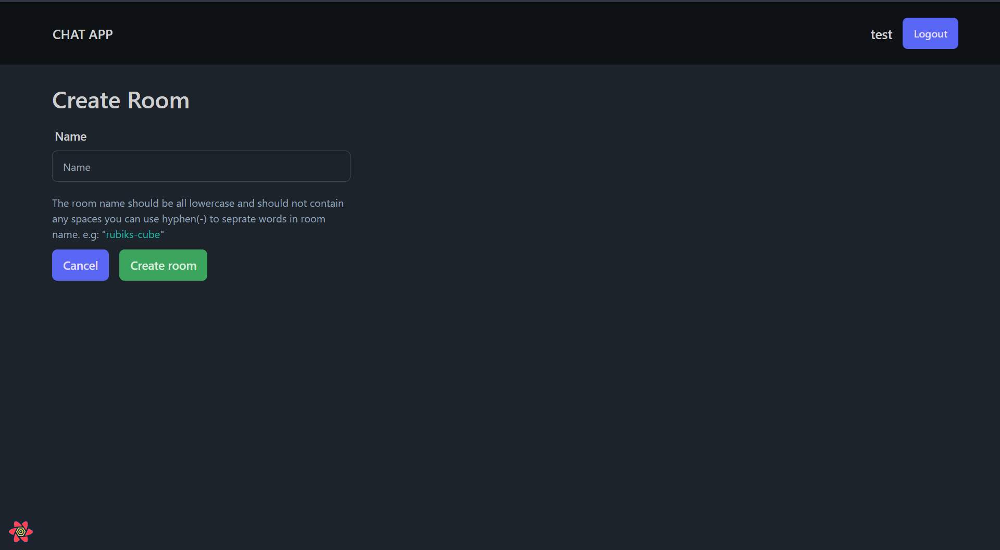

# 🗨️ Chat App

I made this chat app using NodeJS with Nest JS as the backend framework.It uses websockets for realtime communication.It has authentication so users and create their accounts to chat with other people.I used Next js for frontend and React Query for state mangement.

## 🐈 Features

-   Register
-   Login
-   Logout
-   Dynamic room page for chatting
-   Create a room
-   View joined rooms
-   Join a new room(with web socket)
-   Notify other users that a new user has joined the chat
-   Send message
-   Receive message
-   Show someone user is typing

## ⚙️ Technologies

-   Frontend
    -   Next JS
    -   Axios
    -   React Query
    -   Day JS
    -   Formik
    -   Socket.io Client
    -   Tailwind CSS
    -   Tailwind Merge
    -   DaisyUI
    -   Typescript
-   Backend
    -   Nest JS
    -   Prisma ORM
    -   PostgresSQL
    -   Argon2
    -   Redis
    -   Session Auth
    -   Socket.io
    -   Swagger API Docs

## 📷 Screenshots

## 🙋🏻‍♂️ Stay in touch

-   Author - [Naman Arora](https://namanarora.vercel.app)
-   Website - [https://namanarora.vercel.app](https://namanarora.vercel.app)
-   Twitter - [@namanarora1022](https://twitter.com/namanarora1022)

## 📝 License

[MIT licensed](LICENSE).
